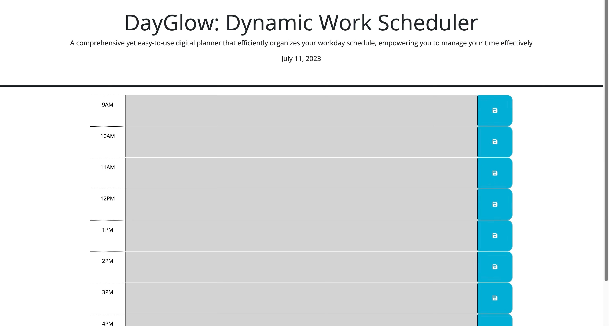

# DayGlow: Dynamic Work Scheduler

## Description

DayGlow: Dynamic Work Scheduler is an intuitive and user-friendly application designed to streamline your workday planning process. The interface facilitates seamless and organized scheduling, enabling you to maximize your productivity throughout the day.

Built using HTML5, CSS, and JavaScript, DayGlow utilizes the power of Bootstrap for a responsive layout, catering to varying screen sizes. Furthermore, Day.js is incorporated for accurate date and time operations.

Key Features

1. Real-Time Task Status: Each time block in the scheduler dynamically changes color based on the status of the task. Past tasks are marked grey, present tasks are highlighted red, and future tasks are colored green. This visual representation provides you with a quick overview of your day.
2. Persistent Task Data: DayGlow uses local storage to save your tasks. This means your task data persists even when you refresh the page or close the browser, ensuring you never lose track of your tasks.
3. Quick Planner Reset: A single-click button to clear all tasks allows you to efficiently reset your daily plan whenever needed.
4. Daily Overview: The application features a prominently displayed current date at the top of the page to provide you with a daily snapshot at a glance.

Whether you need to manage meetings, allocate time for project work, or simply remember to take a well-deserved break, DayGlow: Dynamic Work Scheduler makes the task of planning your day both simple and efficient. Experience the transformation in your day-to-day scheduling with DayGlow.

## Screenshot

## Link to the Deployed Application

Link to Deployed Application: https://kojootchere.github.io/DayGlow-Dynamic-Work-Scheduler/